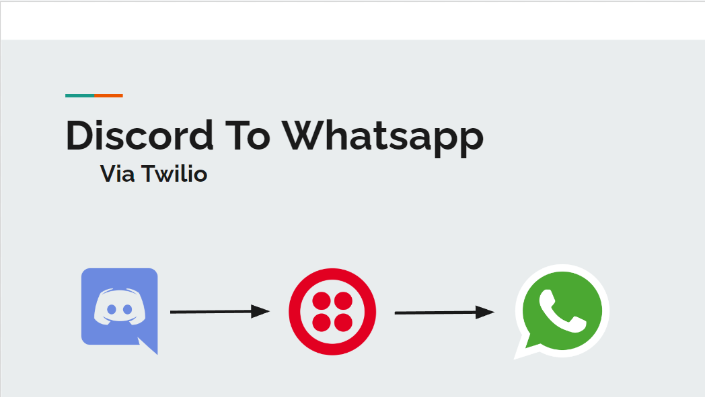

# Discord-To-WhatsApp-Bot

A hackathon project for a prototype of a bot which enables one-way syncronisation between Discord and WhatsApp.
Created for a <a href="https://esolangconf.com/">Paradigm Conference 2022</a>, a unique hackathon designed to expose secondary school students and beginning university students to a variety of programming languages, and broaden their horizons.

This project is detailled more fully on its <a href="https://devpost.com/software/discord-to-whatsapp-bot">DevPost Page</a>.
